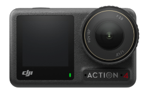

# PyOsmoGPS

PyOsmoGPS is a Python library designed to extract GPS data embedded in video files created by the DJI Osmo Action 4 or Osmo Action 5 cameras. It converts the GPS data into GPX files for further processing or analysis.

## Features

- Extracts GPS data from video files.
- Supports DJI Osmo Action 4 and 5 cameras.
- Converts GPS data to standard GPX format.
- Allows customization of output frequency and resampling methods.
- Implements filtering and interpolation algorithms for better accuracy.
- Provides a command-line interface for easy use.

## Disclaimer

This project is **not affiliated, sponsored, or approved by DJI**. DJI is a registered trademark of SZ DJI Technology Co., Ltd. The use of their product names is purely for descriptive purposes to indicate compatibility.

## How to Use

### Installation

You can install PyOsmoGPS using pip:

```bash
pip install pyosmogps
```

### Usage

You can use PyOsmoGPS as a command-line tool or as a Docker container. The tool checks that the input video file is compatible with the DJI Osmo Action 4 or 5 cameras and that it contains GPS data, extracting it and converting it to a `.gpx` file. It can be used to create video overlays with GPS data or to analyze the GPS track.

The GPS data is stored when the camera is successfully connected to the remote controller and the GPS signal is acquired. The data is embedded in the video file and can be extracted using PyOsmoGPS.




A compatible tool for the video overlay creation is [gopro-dashboard-overlay](https://github.com/time4tea/gopro-dashboard-overlay), which has a gpx input mode that can be used with the output of PyOsmoGPS.

#### Command-Line Tool

To extract GPS data from a video file and save it as a GPX file, you can use the following command:

```bash
pyosmogps extract input.mp4 output.gpx
```

This command will read the GPS data from the video file `input.mp4` and save it as a GPX file `output.gpx`.

If you want to extract GPS data from multiple video files, you can specify them as a list:

```bash
pyosmogps extract input1.mp4 input2.mp4 input3.mp4 output.gpx
```

In this case the GPS data from all the input files will be combined and saved in the output GPX file.

You can customize the output frequency and resampling method using the following options:

```bash
pyosmogps --frequency 5 --resampling-method lpf extract input.mp4 output.gpx
```

where frequency indicates the output frequency in Hz and method specifies the resampling method (`lpf` for low-pass filtering, `linear` for linear interpolation or `discard` for dropping samples).

You may need to specify the time offset from the default timezone in qhich the data is stored in the video file. This can be done using the `--time-offset` option:

```bash
pyosmogps --timezone-offset 2 extract input.mp4 output.gpx
```

For more information on the available options, you can use the `--help` flag:

```bash
pyosmogps --help
```
